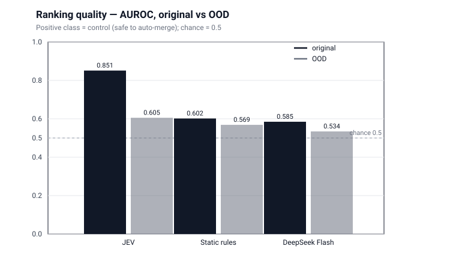
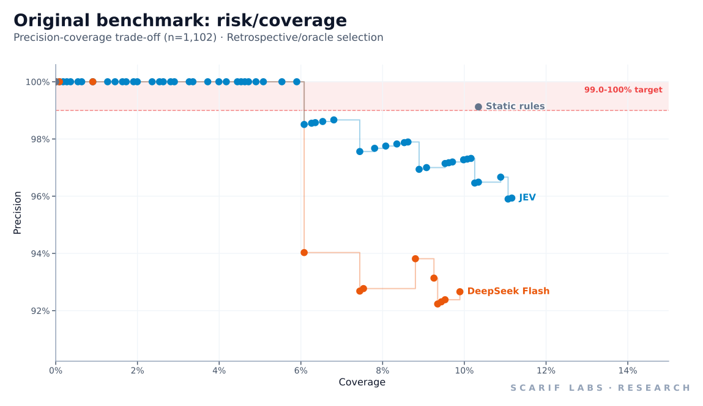
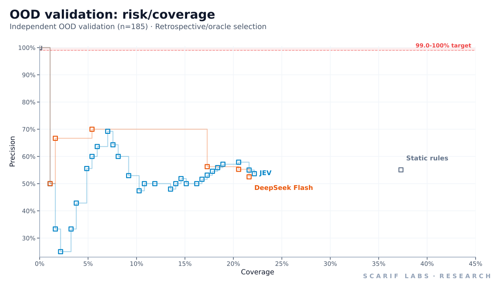
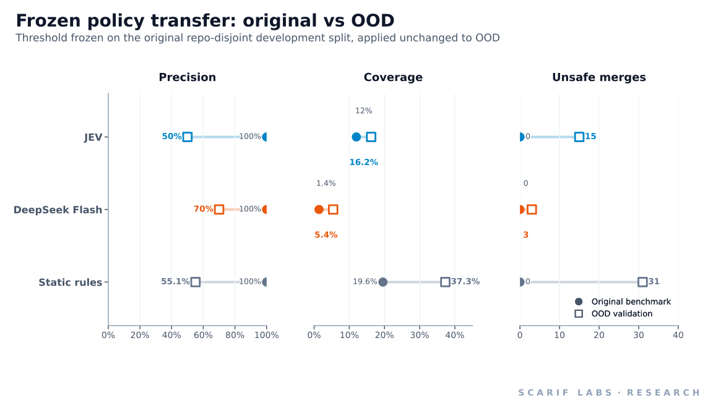

# JEV as a Software Decision Primitive

Independent benchmark of JEV for dependency-update automation under distribution shift.

An independent Scarif Labs evaluation of a machine-native probabilistic decision primitive
in a real software workflow.

## Abstract

We measured whether **JEV** (TypeSafe's System One decision model) can provide useful and
reliable decisions when embedded in a real software automation workflow, using dependency
updates as the concrete test case. JEV was compared against a deterministic static policy
and a strong general LLM (**DeepSeek Flash**) on identical pre-merge state. On a 1,102-case
in-distribution benchmark (551 breaking / 551 control), JEV showed substantially stronger
ranking quality (AUROC **0.851**) than static rules (**0.602**) and DeepSeek Flash
(**0.585**). On an independently constructed 185-case out-of-distribution (OOD) set
(100 breaking / 85 control, 103 independent repositories), JEV retained the highest AUROC
among the three (**0.605**, 95% CI 0.525–0.685) but the absolute performance fell sharply.
The important negative finding is operational: JEV's **frozen in-distribution threshold did
not transfer safely** — the threshold 0.62 produced 30 auto-merges at **50.0% precision**
with **15 unsafe merges**. The benchmark found a strong in-distribution JEV ranking signal
that weakened substantially under independent distribution shift. These results do not
establish general superiority or inferiority of JEV as a general decision primitive.



## What we tested

We tested a general software-systems idea: can a **typed probabilistic decision primitive**
provide decisions and uncertainty that ordinary code can consume directly inside a real
automation workflow? Dependency-update automation is the test case, not the product.

The benchmark separates three questions that are easy to conflate:

1. **Decision / ranking quality** — does the score rank safe updates above unsafe ones?
2. **Probability calibration** — do the numeric probabilities mean the same thing on new data?
3. **Safe operational automation** — does a fixed threshold achieve a target precision on
   new data without unsafe actions?

A system can do well on (1) while failing (2) and (3). That distinction is central to the
findings.

## Context: JEV / System One

TypeSafe describes JEV and its **System One** models as structured, machine-oriented
decision systems intended to return typed decisions and uncertainty that software can
consume directly, rather than generated text. This repository is an **independent test of
that general idea**; it is not a reproduction of TypeSafe's own evaluations, a product
review, or an endorsement. Statements about TypeSafe's positioning are attributed to
TypeSafe and are not treated as established facts.

- Technology evaluated: https://typesafe.ai/

## About Scarif Labs

Scarif Labs builds and evaluates software systems that turn emerging computational
primitives into measurable real-world workflows. This artifact is research/evaluation, not
product development.

- Scarif Labs: https://www.scariflabs.com/
- GitHub organization: https://github.com/scarif-labs
- Author: https://github.com/DPRC137

## Experimental design

**Task.** Given one dependency-update PR and only information available *before merge*,
choose `AUTO_MERGE`, `HOLD`, or a human-review action (`REQUIRE_REVIEW` / `HUMAN_REVIEW`).

**State (identical for every model).** Repository, ecosystem, package manager, dependency,
old/new version, update type, security flag, PR title/body, manifest diff, dependency
release notes, and pre-merge CI status. Post-merge facts (merge status, revert, failure
category, gold label) are never included. See `docs/benchmark.md` and
`data/leakage-report.json`.

**Systems compared.**

- **JEV** (`jev-latest`) — one `Choice` question whose criteria are the three actions; the
  answer provides a probability distribution and confidence.
- **DeepSeek Flash** (`~deepseek/deepseek-flash-latest`, returned as
  `deepseek/deepseek-v4.1-flash`) — structured JSON `{decision, risk, confidence}`,
  reasoning disabled, temperature 0.
- **Static rules** — a deterministic Renovate-style policy over update type and CI status.

**Evaluation.** Ranking quality uses AUROC and average precision over the control class.
Operational evaluation uses a threshold selected on a development split and applied
unchanged to a held-out split. Retrospective/oracle numbers (threshold chosen on the
evaluation labels) are always labelled as upper bounds and are kept separate from
deployable frozen-policy numbers. See `METHODOLOGY.md`.

## Results

All tables report the three systems with ranking metrics and operational metrics kept
separate. Figures are in `analysis/figures/`; full tables are in `RESULTS.md`.

### In-distribution (1,102 cases)

| system | AUROC | AP | oracle cov@99% | oracle cov@99.5% | precision@99% | unsafe@99% | mean latency | total cost |
| --- | --- | --- | --- | --- | --- | --- | --- | --- |
| Static rules | 0.602 | 0.486 | 10.34% | 0.00% | 99.12% | 1 | <1 ms | $0 |
| DeepSeek Flash | 0.585 | 0.459 | 0.91% | 0.91% | 100% | 0 | 2,178 ms | $0.7056 |
| JEV | 0.851 | 0.843 | 5.90% | 5.90% | 100% | 0 | 639 ms | $0.1447 |



### Independent OOD validation (185 cases)

| system | AUROC | AP |
| --- | --- | --- |
| Static rules | 0.569 | 0.368 |
| DeepSeek Flash | 0.534 | 0.385 |
| JEV | 0.605 | 0.510 |

JEV AUROC 95% bootstrap CI: 0.525–0.685. Frozen policies transferred from the original
benchmark (no OOD labels used to choose thresholds):

| system | frozen threshold | auto-merged | precision | coverage | unsafe merges |
| --- | --- | --- | --- | --- | --- |
| Static rules | 1.00 | 69 | 55.07% | 37.30% | 31 |
| DeepSeek Flash | 0.90 | 10 | 70.0% | 5.41% | 3 |
| JEV | 0.62 | 30 | 50.0% | 16.22% | 15 |

Retrospective oracle coverage at 99% and 99.5% precision measured 0% for all three systems
on OOD: no threshold on these scores produced a non-empty safe policy even with label access.




## What we learned

- In-distribution, JEV showed a strong ranking signal (AUROC 0.851), well above static
  rules (0.602) and DeepSeek Flash (0.585).
- On the independent OOD set, JEV retained the highest AUROC among the three (0.605) but
  only weakly above chance; the absolute performance fell sharply.
- The probability calibration/threshold did not transfer: the frozen 0.62 policy produced
  50.0% precision and 15 unsafe merges on OOD.
- The threshold-transfer gap is concentrated in non-JavaScript ecosystems
  (JavaScript AUROC 0.673; non-JavaScript 0.379). The OOD population is largely npm.
- Excluding ambiguous reverts did not change the conclusion (AUROC 0.605 → 0.592).
- Ranking quality, calibration, and safe automation are separate properties; the results
  differ across all three.

The benchmark found a strong in-distribution JEV ranking signal that weakened substantially
under independent distribution shift. JEV retained the highest OOD AUROC among the evaluated
systems, but its original probability threshold did not transfer safely.

## What this does not establish

These results do not establish general superiority or inferiority of JEV as a general
decision primitive. They do not establish:

- that JEV is superior to LLMs or to static rules in general;
- that any system here is safe for production dependency automation;
- that JEV produces portable probability calibration across distributions;
- that JEV has no value as a general decision primitive.

## Reproducibility

All reported numbers are generated from canonical JSON artifacts by committed scripts.

```bash
node scripts/generate_public_report.mjs   # RESULTS.md, docs/, results* summaries, manifest
node scripts/make_figures.mjs             # analysis/figures/*.svg
node scripts/verify_public_numbers.mjs    # cross-checks markdown against canonical JSON
```

Raw per-case JSONL contain GitHub PR text and are not redistributed; hashes and
reconstruction scripts are provided. See `REPRODUCIBILITY.md`.

## Limitations

See `LIMITATIONS.md`. In brief: the OOD outcome mechanism differs (in-repository revert
rather than reproduced build failure); the OOD population is largely npm; 15/100 OOD
breaking reverts are ambiguous and only 6 state an explicit causal reason; 9 pre-merge
states are synthesized; 26/100 carry a version-parsing artifact; the original benchmark
shows temporal calibration instability; and the OOD sample is small (185 cases).

## Repository layout

```
README.md              this document
METHODOLOGY.md         data construction, leakage control, evaluation definitions
RESULTS.md             full generated results (in-distribution + OOD)
LIMITATIONS.md         limitations and unresolved questions
REPRODUCIBILITY.md     commands, hashes, and reconstruction
PUBLICATION_CHECKLIST.md
LICENSE                MIT (code and docs)
docs/                  benchmark.md, ood-validation.md, forensic-audit.md
analysis/              canonical JSON/MD analyses + figures/
data/                  schema, manifests, leakage reports (raw case files withheld)
results/               in-distribution public summary
results-ood/           OOD public summary
scripts/               build/evaluate/report/figure scripts
src/                   the frozen decision harness
```

## Data and licensing

- **BUMP** (`chains-project/bump`, MIT) is the source of the in-distribution breaking set.
- **Zenodo 12720767** (CC-BY-4.0) was inspected only and is not included.
- OOD cases and controls derive from public GitHub PRs; raw PR text is not redistributed.
  `data/MANIFEST.json` records hashes and `scripts/` can rebuild the datasets.
